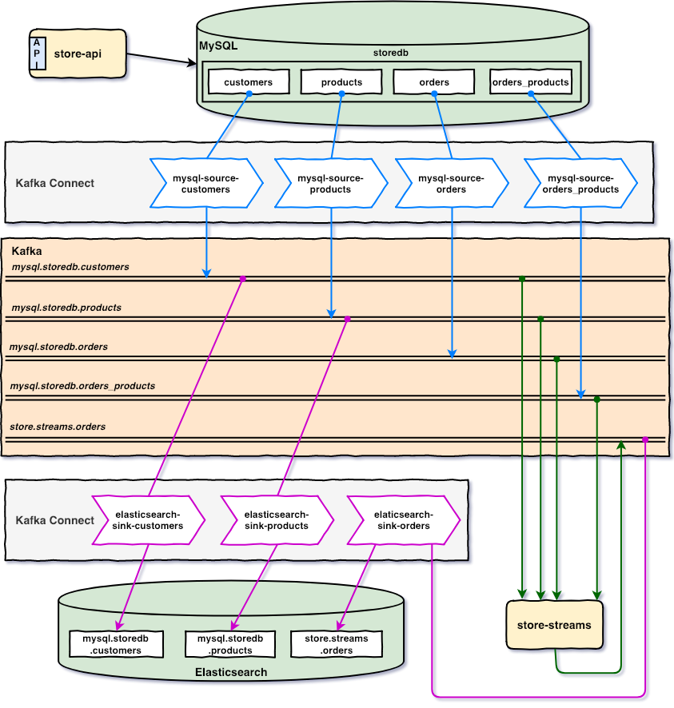
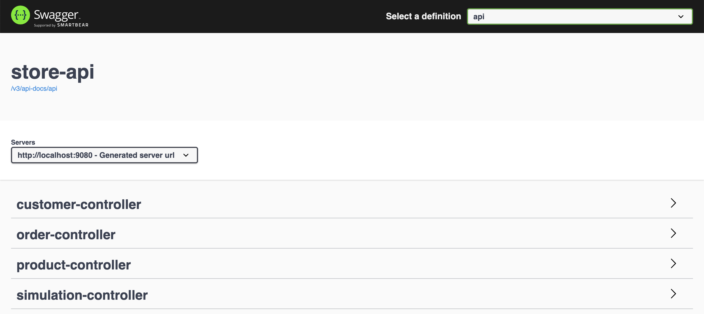

# `springboot-kafka-connect-streams`

The main goal of this project is to play with [`Kafka`](https://kafka.apache.org),
[`Kafka Connect`](https://docs.confluent.io/current/connect/index.html) and
[`Kafka Streams`](https://docs.confluent.io/current/streams/index.html). For this, we have: `store-api` that
inserts/updates records in [`MySQL`](https://www.mysql.com); `Source Connectors` that monitor
inserted/updated records in `MySQL` and push messages related to those changes to `Kafka`; `Sink Connectors` that
listen messages from `Kafka` and insert/update documents in [`Elasticsearch`](https://www.elastic.co); finally,
`store-streams` that listens messages from `Kafka`, treats them using `Kafka Streams` and push new messages back to
`Kafka`.

## Microservices



### store-api

Monolithic Spring-Boot application that exposes a REST API to manage `Customers`, `Products` and `Orders`. The data is
stored in `MySQL`. 

### store-streams

Spring-boot application that connects to `Kafka` and uses `Kafka Streams API` to transform some _"input"_ topics into a
new _"output"_ topic in `Kafka`.

## (De)Serialization formats

In order to run this project, you can use [`JSON`](https://www.json.org) or
[`Avro`](http://avro.apache.org/docs/current/gettingstartedjava.html) format to serialize/deserialize data to/from the
`binary` format used by Kafka. The default format is `JSON`. Throughout this document, I will point out what to do if
you want to use `Avro`.

**P.S. Avro (de)serialization is not completely implemented!**

## Start Environment

Open one terminal and inside `springboot-kafka-connect-streams` root folder run
```
docker-compose up -d
```
> During the first run, an image for `kafka-connect` will be built, whose name is
> `springboot-kafka-connect-streams_kafka-connect`. To rebuild this image run
> ```
> docker-compose build
> ```

Wait a little bit until all containers are `Up (healthy)`. To check the status of the containers run the command
```
docker-compose ps
```

## Run store-api

**It is important to run `store-api` first because it will initialize the MySQL database**.

In a new terminal, run the command below inside `springboot-kafka-connect-streams` root folder
```
./mvnw spring-boot:run --projects store-api
```
> Note. It will create some customers and products. If you don't want it, just set to `false` the properties
> `load-samples.customers.enabled` and `load-samples.products.enabled` in `application.yml`.

The Swagger link is http://localhost:9080/swagger-ui.html



## Create connectors

In a terminal, run the following script to create the connectors on `kafka-connect`
- **For JSON (de)serialization**
```
./create-connectors-jsonconverter.sh
```
- **For Avro (de)serialization**
```
./create-connectors-avroconverter.sh
```

You can check the state of the connectors and their tasks on `Kafka Connect UI` or running the following script
```
./check-connectors-state.sh
```

Once the connectors and their tasks are ready (`RUNNING` state), you should see something like
```
{"name":"mysql-source-customers","connector":{"state":"RUNNING","worker_id":"kafka-connect:8083"},"tasks":[{"state":"RUNNING","id":0,"worker_id":"kafka-connect:8083"}],"type":"source"}
{"name":"mysql-source-products","connector":{"state":"RUNNING","worker_id":"kafka-connect:8083"},"tasks":[{"state":"RUNNING","id":0,"worker_id":"kafka-connect:8083"}],"type":"source"}
{"name":"mysql-source-orders","connector":{"state":"RUNNING","worker_id":"kafka-connect:8083"},"tasks":[{"state":"RUNNING","id":0,"worker_id":"kafka-connect:8083"}],"type":"source"}
{"name":"mysql-source-orders_products","connector":{"state":"RUNNING","worker_id":"kafka-connect:8083"},"tasks":[{"state":"RUNNING","id":0,"worker_id":"kafka-connect:8083"}],"type":"source"}
{"name":"elasticsearch-sink-customers","connector":{"state":"RUNNING","worker_id":"kafka-connect:8083"},"tasks":[{"state":"RUNNING","id":0,"worker_id":"kafka-connect:8083"}],"type":"sink"}
{"name":"elasticsearch-sink-products","connector":{"state":"RUNNING","worker_id":"kafka-connect:8083"},"tasks":[{"state":"RUNNING","id":0,"worker_id":"kafka-connect:8083"}],"type":"sink"}
{"name":"elasticsearch-sink-orders","connector":{"state":"RUNNING","worker_id":"kafka-connect:8083"},"tasks":[{"state":"RUNNING","id":0,"worker_id":"kafka-connect:8083"}],"type":"sink"}
```

On `Kafka Connect UI` (http://localhost:8086), you should see


If there is any problem, you can check `kafka-connect` container logs.
```
docker logs kafka-connect -f
```

Connectors use `Converters` for data serialization and deserialization. If you are configuring `For JSON (de)serialization`,
the converter used is `JsonConverter`. On the other hand, the converter used is `AvroConverter`.

**IMPORTANT**: if the `Source Connector Converter` serializes data, for instance, from `JSON` to `bytes` (using
`JsonConverter`), then the `Sink Connector Converter` must also use `JsonConverter` to deserialize the `bytes`,
otherwise an error will be thrown. The document
[Kafka Connect Deep Dive – Converters and Serialization Explained](https://www.confluent.io/blog/kafka-connect-deep-dive-converters-serialization-explained)
explains it very well.

## Run store-streams

Open a new terminal and inside `springboot-kafka-connect-streams` root folder, run
- **For JSON (de)serialization**
```
./mvnw spring-boot:run --projects store-streams
```
- **For Avro (de)serialization (NOT READY!)**
```
./mvnw spring-boot:run --projects store-streams -Dspring-boot.run.profiles=avro
```

> Note. the command below generates Java classes from Avro files
> ```
> ./mvnw generate-sources --projects store-streams
> ```

This service runs on port `9081`. The `health` endpoint is http://localhost:9081/actuator/health

## Testing

First, let's check the orders we have in `Elasticsearch`
```
curl http://localhost:9200/store.streams.orders/_search?pretty
```
The response should be no orders
```
{
  "took" : 93,
  "timed_out" : false,
  "_shards" : {
    "total" : 5,
    "successful" : 5,
    "skipped" : 0,
    "failed" : 0
  },
  "hits" : {
    "total" : 0,
    "max_score" : null,
    "hits" : [ ]
  }
}
```

Let's simulate an order creation. In this example, customer with id `1`
(`{"id":1, "name":"John Gates", "email":"john.gates@test.com", "address":"street 1", "phone":"112233"}`)
will order one unit of the product with id `15` (`{"id":15, "name":"iPhone Xr", "price":900.00}`).
```
curl -i -X POST http://localhost:9080/api/orders \
  -H 'Content-Type: application/json' \
  -d '{"customerId": 1, "paymentType": "BITCOIN", "status": "OPEN", "products": [{"id": 15, "unit": 1}]}'
```
The response should be
```
HTTP/1.1 201
{
  "customerId": 1,
  "id": "00f708f2-0b0d-47d0-9d90-e42a34857064",
  "paymentType": "BITCOIN",
  "products": [
    {
      "id": 15,
      "unit": 1
    }
  ],
  "status": "OPEN"
}
```

Now, if we check `Elasticsearch` again
```
curl http://localhost:9200/store.streams.orders/_search?pretty
```
We should have one order with customer and products names.
```
{
  "took" : 55,
  "timed_out" : false,
  "_shards" : {
    "total" : 5,
    "successful" : 5,
    "skipped" : 0,
    "failed" : 0
  },
  "hits" : {
    "total" : 1,
    "max_score" : 1.0,
    "hits" : [
      {
        "_index" : "store.streams.orders",
        "_type" : "order",
        "_id" : "ce314c0b-8e9b-47b7-9522-defacd163656",
        "_score" : 1.0,
        "_source" : {
          "payment_type" : "BITCOIN",
          "created_at" : "2019-07-08T22:12:44.000+0000",
          "id" : "ce314c0b-8e9b-47b7-9522-defacd163656",
          "customer_name" : "John Gates",
          "customer_id" : 1,
          "status" : "OPEN",
          "products" : [
            {
              "unit" : 1,
              "price" : null,
              "name" : "iPhone Xr",
              "id" : 15
            }
          ]
        }
      }
    ]
  }
}
```

In order to create random orders, we can use also the `simulation` endpoint of `store-api`
```
curl -i -X POST http://localhost:9080/api/simulation/orders \
  -H 'Content-Type: application/json' \
  -d '{"total": 5, "sleep": 100}'
```

## Useful Links/Commands

### Kafka Topics UI

Kafka Topics UI can be accessed at http://localhost:8085

### Kafka Connect UI

Kafka Connect UI can be accessed at http://localhost:8086

### Schema Registry UI

Schema Registry UI can be accessed at http://localhost:8001

### Schema Registry

You can use `curl` to check the subjects in Schema Registry

- Get the list of subjects
```
curl localhost:8081/subjects
```
- Get the latest version of the subject `mysql.storedb.customers-value`
```
curl http://localhost:8081/subjects/mysql.storedb.customers-value/versions/latest
```

### Kibana

`Kibana` can be accessed at http://localhost:5601

### Kafka Manager

`Kafka Manager` can be accessed at http://localhost:9000

**Configuration**
- First, you must create a new cluster. Click on `Cluster` (dropdown on the header) and then on `Add Cluster`
- Type the name of your cluster in `Cluster Name` field, for example: `MyZooCluster`
- Type `zookeeper:2181` in `Cluster Zookeeper Hosts` field
- Enable checkbox `Poll consumer information (Not recommended for large # of consumers if ZK is used for offsets tracking on older Kafka versions)`
- Click on `Save` button at the bottom of the page.

### Elasticsearch

`Elasticsearch` can be accessed at http://localhost:9200

- Get all indices
```
http://localhost:9200/_cat/indices?v
```
- Search for documents
```
http://localhost:9200/mysql.storedb.customers/_search?pretty
http://localhost:9200/mysql.storedb.products/_search?pretty
http://localhost:9200/store.streams.orders/_search?pretty
```

### Kafkacat

```
docker run --tty --interactive --rm --network=springboot-kafka-connect-streams_default \
  confluentinc/cp-kafkacat:5.2.2 kafkacat -b kafka:9092\
  -f '\nKey (%K bytes): %k\t\nValue (%S bytes): %s\n\Partition: %p\tOffset: %o\n--\n' \
  -t mysql.storedb.customers -C -c1
```

### MySQL
```
docker exec -it mysql mysql -uroot -psecret --database storedb
select * from customers;
```

## Shutdown

Run the command below in order to stop and remove containers, networks and volumes
```
docker-compose down -v
```

## TODO

- implement, inside `StoreStreamsAvro`, the logic to join `KTables` and `KStreams` to produce `OrderDetailed` output using `Avro`.
- fix connector `avroconverter/elasticsearch-sink-orders.json`.

## References

- https://www.confluent.io/blog/simplest-useful-kafka-connect-data-pipeline-world-thereabouts-part-1 (2 and 3)
- https://www.confluent.io/blog/kafka-connect-deep-dive-converters-serialization-explained

## Issues

- Product `price` field, [numeric.mapping doesn't work for DECIMAL fields #563](https://github.com/confluentinc/kafka-connect-jdbc/issues/563)
